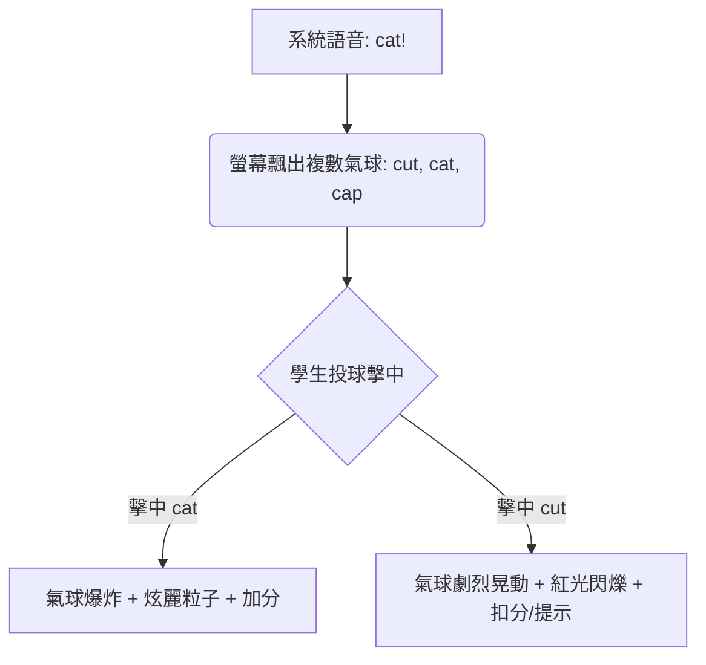

# 🎮 電子白板 × 吸盤黏黏球（Sticky Ball）互動遊戲企劃書

這是一份專為國中小英文課堂設計的**電子白板互動遊戲企劃**。透過學生實體投擲吸盤黏黏球（Sticky Ball）擊中電子白板，與螢幕上的動態遊戲畫面進行即時互動。

本企劃完美契合 **ROCK 老師的英文遊戲廳** 既有的現代化、高質感（Glassmorphism 玻璃擬物、霓虹發光、動態微交互）視覺風格，並針對「投擲物理操作」進行了專門的硬體與軟體優化。

---

## 💡 一、 硬體運作原理與技術對策

在開始設計遊戲前，我們需要先釐清電子白板接收「吸盤球投擲」的運作機制與技術限制：

### 1. 觸控訊號轉換
當吸盤球擊中電子白板時，白板的紅外線框（Infrared Frame）或電容感應會將該衝擊點偵測為一次 **觸控點擊（`PointerDown` / `Click`）** 事件。在網頁端，這與滑鼠點擊或手指觸控完全相同，因此**所有現有的 HTML5 / JavaScript 遊戲技術皆可無縫支援**。

### 2. 物理痛點與軟體解決方案

| 物理痛點 | 實際課堂狀況 | 軟體技術對策 |
| :--- | :--- | :--- |
| **重複觸發 (Jitter / Double Click)** | 吸盤球擊中時可能會彈跳、滑行或在白板上停留，導致短時間內觸發多次 Click 事件。 | **點擊防抖與冷卻機制 (Debounce & Cooldown)**：<br>點擊後該目標立即進入 1.5 秒的「無敵/冷卻狀態」，並忽視後續多餘的觸控訊號。 |
| **投擲精準度限制** | 學生距離白板 2-3 公尺投擲，很難精準擊中小按鈕。 | **超大擊中判定區 (Large Hitboxes)**：<br>目標半徑至少設計在 **150px - 200px** 以上，且按鈕間距加大，避免誤擊。 |
| **白板防護與安全** | 學生為了求快，可能會用力過猛丟球，損壞白板或砸到同學。 | **時效與策略性設計**：<br>避免設計「越大力越高分」或「極速狂丟」的機制。改為以**時機（Timing）**、**精準（Precision）**與**策略選擇**為主。 |

---

## 🎮 二、 四大互動遊戲企劃案

為了讓課堂氣氛達到最高潮，以下設計了四款不同機制的遊戲模式：

### 1. 🎈 氣球爆爆樂 (Phonics Balloon Pop)
*   **遊戲主題**：發音與聽力辨字
*   **視覺風格**：夢幻霓虹夜空，不同顏色的發光透明氣球從畫面下方緩緩飄上來（Glassmorphic Bubble 質感），每個氣球裡面裝著一個字母或單字。
*   **遊戲玩法**：
    1. 系統播放語音（例：`"Find the word with /æ/ sound... cat!"`）或在頂部顯示中文提示。
    2. 畫面上同時漂浮著 3-5 個不同單字的氣球。
    3. 學生投球擊中正確的氣球。
*   **物理反饋 (Wow Factor)**：
    *   **擊中正確**：氣球瞬間「砰！」爆裂，爆出五彩斑斕的粒子（Canvas Particle Explosion），並伴隨清脆的破裂聲。
    *   **擊中錯誤**：氣球像被水球打到一樣劇烈左右晃動（CSS Jiggly Animation），並閃爍紅光，發出「啵呦～」的彈性阻擋聲。



---

### 2. 🏰 巨獸討伐戰：靶面大獵殺 (Monster Siege: Target Clash)
*   **遊戲主題**：核心文法與句型 Mastery（適合複賽、Boss 戰）
*   **視覺風格**：懷舊 RPG 城堡防禦風格。一隻巨大的 Q 版惡龍或史萊姆魔王佔據半個螢幕，牠的手下（小怪物）會拿著帶有答案的「盾牌/木靶」跑出來。
*   **遊戲玩法**：
    1. 頂部顯示文法題目（例：`"___ you want some milk? Yes, please."`）。
    2. 左右兩側的小怪物分別舉著 **[Do]** 與 **[Does]** 的盾牌。
    3. 學生必須用球砸中舉著 **[Do]** 的小怪物盾牌。
    4. 成功擊中時，小怪物會被打飛，大魔王的 HP 條扣減，並播放受擊特效。
    5. **狂熱時間 (Fever Time)**：當大魔王進入虛弱狀態，身上會隨機浮現 3 個紅色的「弱點鏢靶（Bulls-eye）」，學生可以全班一起連環投擲，限時內砸中越多弱點傷害越高！
*   **設計優點**：極度適合團體合作，全班一起為投手加油，尖叫聲不斷。

---

### 3. 🐹 英文打地鼠：單字極速賽 (Whack-A-Mole Word Blitz)
*   **遊戲主題**：單字快速認讀與圖像記憶
*   **視覺風格**：3D 微立體發光樹洞，具有強烈科技感的霓虹洞口。
*   **遊戲玩法**：
    1. 畫面上共有 4 或 6 個發光洞口。
    2. 題目顯示一個單字或圖片（例：`"Apple"` 蘋果圖片）。
    3. 洞口會隨機冒出戴著不同單字帽子的地鼠（例：`banana`, `apple`, `orange`）。
    4. 地鼠探頭停留的時間只有 2-3 秒，學生必須在時限內看準、快速投球擊中正確的地鼠。
    5. 擊中地鼠時，地鼠會被打扁（Squash 變形動畫）並縮回洞裡，冒出 `+100` 的飄浮文字。
*   **物理反饋**：由於地鼠是有時間限制的，這非常考驗學生的手眼協調與瞬間反應力，速度與投擲技巧並重。

---

### 4. 🎯 幸運輪盤鏢靶王 (Spinning Dartmaster)
*   **遊戲主題**：全單字/文法總複習 與 課堂獎勵運氣
*   **視覺風格**：華麗的嘉年華旋轉輪盤，每個扇區都是一個精美的玻璃卡片，寫著不同的答案或分數加倍（例：`Double`、`+50`、`Bomb`）。
*   **遊戲玩法**：
    1. 輪盤會以中等速度旋轉。
    2. 題目顯示於中央（例：`"He _____ to school every day."`）。
    3. 輪盤的扇區包含：`go`, `goes`, `going` 以及運氣板塊。
    4. 學生必須預判旋轉軌跡，投出黏黏球。擊中時輪盤會卡住，並放大顯示被黏住的那個扇區。
*   **物理反饋**：結合了「英文能力」與「物理預判/運氣」，即使是英文比較落後的孩子，也有機會靠著丟中「分數加倍」或「黃金靶心」來逆轉勝，能有效提升全班參與度。

---

## 🛠️ 三、 前端技術實作指南 (HTML5 / JS)

為了方便 ROCK 老師直接在既有的代碼庫中開發，以下提供兩個最重要的核心功能 JavaScript / CSS 實做模板。

### 1. 投擲防抖與點擊冷卻 (Input Debouncing & Cooldown)
這是防止黏黏球在白板上滑動造成「連擊錯誤」的關鍵程式碼：

```javascript
// 核心防抖處理器
class StickyBallTarget {
    constructor(element, onHitCallback) {
        this.element = element;
        this.onHit = onHitCallback;
        this.isCooldown = false;
        this.cooldownTime = 1500; // 1.5秒冷卻

        // 同時監聽 pointerdown 以支援白板觸控與滑鼠測試
        this.element.addEventListener('pointerdown', (e) => this.handleHit(e));
    }

    handleHit(event) {
        event.preventDefault();
        
        // 如果在冷卻中，直接無視此次撞擊
        if (this.isCooldown) return;

        this.isCooldown = true;
        this.element.classList.add('hit-cooldown');

        // 獲取擊中座標（用於粒子特效）
        const rect = this.element.getBoundingClientRect();
        const hitX = event.clientX - rect.left;
        const hitY = event.clientY - rect.top;

        // 觸發擊中回呼
        this.onHit({ x: event.clientX, y: event.clientY, target: this.element });

        // 設定冷卻結束，恢復可擊中狀態
        setTimeout(() => {
            this.isCooldown = false;
            this.element.classList.remove('hit-cooldown');
        }, this.cooldownTime);
    }
}

// 實用 CSS 樣式配合
/*
.hit-cooldown {
    opacity: 0.6;
    pointer-events: none; // 冷卻時無法點擊
    filter: grayscale(80%);
    transition: all 0.3s ease;
}
*/
```

---

### 2. 擊中炫麗粒子爆炸特效 (Canvas Confetti Explosion)
當黏黏球擊中目標時，在白板螢幕上產生四散的發光彩屑，能給予學生極強的正向回饋：

```javascript
// 建立一個覆蓋全螢幕的 Canvas 用於渲染粒子
const canvas = document.createElement('canvas');
canvas.style.position = 'fixed';
canvas.style.inset = '0';
canvas.style.pointerEvents = 'none';
canvas.style.zIndex = '99999';
document.body.appendChild(canvas);
const ctx = canvas.getContext('2d');

let particles = [];

// 調整 Canvas 大小
function resizeCanvas() {
    canvas.width = window.innerWidth;
    canvas.height = window.innerHeight;
}
window.addEventListener('resize', resizeCanvas);
resizeCanvas();

class Particle {
    constructor(x, y, color) {
        this.x = x;
        this.y = y;
        this.size = Math.random() * 8 + 6;
        this.speedX = (Math.random() - 0.5) * 12;
        this.speedY = (Math.random() - 0.5) * 12 - 4; // 帶有一點向上的初速度
        this.gravity = 0.3;
        this.color = color;
        this.alpha = 1;
        this.decay = Math.random() * 0.015 + 0.01;
    }

    update() {
        this.x += this.speedX;
        this.y += this.speedY;
        this.speedY += this.gravity; // 受重力影響下墜
        this.alpha -= this.decay;
    }

    draw() {
        ctx.save();
        ctx.globalAlpha = this.alpha;
        ctx.fillStyle = this.color;
        ctx.beginPath();
        // 畫出圓形彩屑，也可以改成旋轉的方形
        ctx.arc(this.x, this.y, this.size, 0, Math.PI * 2);
        ctx.fill();
        ctx.restore();
    }
}

// 觸發爆炸函數
function createExplosion(x, y) {
    const colors = ['#fbbf24', '#ec4899', '#3b82f6', '#10b981', '#a855f7', '#f97316'];
    for (let i = 0; i < 30; i++) {
        const color = colors[Math.floor(Math.random() * colors.length)];
        particles.push(new Particle(x, y, color));
    }
}

// 動態循環渲染
function animateParticles() {
    ctx.clearRect(0, 0, canvas.width, canvas.height);
    particles = particles.filter(p => p.alpha > 0);
    particles.forEach(p => {
        p.update();
        p.draw();
    });
    requestAnimationFrame(animateParticles);
}
animateParticles();

// 使用範例：當目標被擊中時
// createExplosion(event.clientX, event.clientY);
```

---

## 👥 四、 課堂教學分組機制建議

為了將這款遊戲發揮最大效益，強烈建議在遊戲中內建 **「雙人PK / 雙隊抗衡模式」**：

1.  **兩隊輪流投擲 (Turn-based Team VS)**：
    *   將班級分為 A、B 兩組，每組輪流派出一名選手站在投擲線上。
    *   白板顯示題目，倒數 5 秒，選手投球。
    *   投中正確答案為小隊加分，投錯不給分並由對方獲得補投機會。
2.  **神射手加成 (Multiplier Combo)**：
    *   如果小隊連續 3 次投中正確答案，觸發「神射手連擊 (3-Combo Fever)」，下一次投中分數翻倍！
    *   這可以激勵投擲技巧較強的同學，也增加策略調度的樂趣。
3.  **大眾救援機制 (Classroom Assist)**：
    *   如果台上的選手投了 2 次都沒中，可以啟動「全班救援」，由台下的隊友大聲拼讀出單字，或做肢體動作給予提示，增強台下學生的專注度與參與感。

---

## 🚀 五、 總結與下一步行動

這款遊戲企劃結合了**身體動能（Kinesthetic Learning）**與**學術反饋**，能完美解決傳統電子白板在課堂中「只有少數學生在前面點擊，其他人在後面發呆」的痛點。

### 接下來我們可以做什麼？
如果您對上述某個企劃有興趣，我們可以直接在代碼庫中建立一個**全新獨立的遊戲 HTML 網頁**（例如 `stickyball.html` 或 `balloon_pop.html`）。

我們可以打造一個具有以下特點的 **「氣球爆爆樂 Phonics Balloon Pop」極速原型**：
1.  **完美匹配 `index.html` 的暗黑炫彩 UI 設計**，使用 Quicksand 字體與 CSS Glassmorphism 漸層。
2.  **內建單字庫（可載入您 G4/G5 的現成教材）**。
3.  **完全實作上述的「防滑球抖動防護」與「Canvas 彩色粒子爆破特效」**。
4.  **提供超大投擲點擊區與華麗的音效回饋**。

請問您最喜歡哪一個遊戲提案呢？是否需要我現在為您撰寫這款遊戲的原型程式碼？
